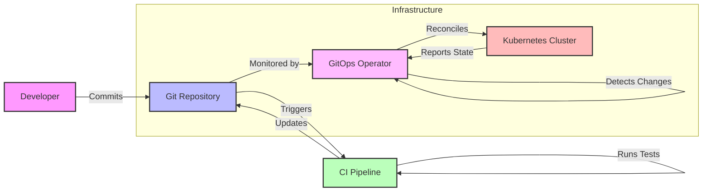

# GitOps: Modern Infrastructure Management

# GitOps: Modern Infrastructure Management

GitOps is a transformative approach to infrastructure and application management that leverages Git's powerful version control capabilities as the single source of truth. By treating infrastructure as code and embracing declarative configurations, GitOps enables organizations to achieve consistent, automated, and auditable infrastructure management across their entire technology stack.

At its core, GitOps extends well-established DevOps practices by applying Git workflows to operational tasks. This means every change to your infrastructure—from updating a container image to modifying a network policy—is captured in version control, providing complete transparency and traceability of system evolution over time.

## Why GitOps?

GitOps emerged as a solution to the challenges of traditional infrastructure management methods. Here are some reasons to adopt GitOps:

* **Increased Velocity:** Through automated deployments and continuous reconciliation, changes can be implemented faster and more safely.
* **Improved Stability:** Thanks to version control and rollback capabilities, the impact of faulty changes is minimized, and system stability is increased.
* **Enhanced Security:** Security is enhanced by reducing the number of components that require direct cluster access and simplifying security audits.
* **Better Auditability:** A complete audit trail is provided by tracking and recording all changes in Git.
* **Easier Rollbacks:** Unwanted changes can be easily reverted thanks to Git's version control.
* **Promoting DevOps Practices:** The DevOps culture is supported by applying Git workflows familiar to development teams to operational processes.

## Core Principles of GitOps

The GitOps methodology is built upon several fundamental principles that guide its implementation:

1. **Declarative Configuration:** All system configurations are defined declaratively, specifying the desired state rather than the steps to achieve it. This approach makes configurations easier to understand, maintain, and automate.
2. **Version Control:** Git serves as the single source of truth for infrastructure definitions. Every change is tracked, reviewed, and approved through Git workflows, providing a complete audit trail and the ability to roll back changes when needed.
3. **Automated Synchronization:** The desired state defined in Git is automatically synchronized with the running system, ensuring consistency and reducing manual intervention.
4. **Continuous Reconciliation:** The system continuously monitors for drift between the desired state (Git) and the actual state (running system), automatically correcting any discrepancies.

## Core Models in GitOps Implementation

### Push Model Architecture

The push model represents the traditional approach to continuous deployment, where an external CI/CD pipeline actively manages the Kubernetes cluster configuration. In this architecture:

* External CI/CD tools (like Jenkins, GitLab CI, or GitHub Actions) have direct access to the cluster.
* Changes are initiated and executed from outside the cluster.
* The pipeline is responsible for maintaining cluster state.
* Authentication and authorization are managed through external service accounts.

Example workflow:

1. Developer commits infrastructure changes to Git.
2. CI/CD pipeline detects the change.
3. Pipeline authenticates with the Kubernetes cluster.
4. Changes are pushed directly to the cluster.
5. Resources are created or updated based on the new configuration.

### Pull Model Architecture

The pull model introduces a more secure and controlled approach to deployment by inverting the traditional flow. A specialized operator running inside the Kubernetes cluster monitors Git repositories for changes and pulls updates as needed. This architecture offers several advantages:

* Improved security through a reduced attack surface (no external access required).
* Better separation of concerns between CI and CD.
* Enhanced reliability through continuous state reconciliation.
* Simplified firewall configurations as connections are initiated from inside the cluster.

Example workflow:

1. Developer commits infrastructure changes to Git.
2. Operator (e.g., Flux, Argo CD) detects changes in the monitored repository.
3. Operator compares the desired state with the current cluster state.
4. If differences exist, the operator pulls the new configurations.
5. Changes are applied to bring the cluster in line with the desired state.

## Comparison of Models

| Feature            | Push Model                                   | Pull Model                               |
|--------------------|----------------------------------------------|-------------------------------------------|
| Cluster Access     | External CI/CD tools have direct access      | Operator inside the cluster pulls changes |
| Security           | Requires careful credential management        | More secure, reduced attack surface       |
| Complexity         | Simpler initial setup                         | More complex initial setup                |
| Reconciliation     | Typically triggered by the CI/CD pipeline    | Continuous reconciliation by the operator |
| Firewall Rules     | Requires inbound rules for cluster access     | Outbound rules only (from the cluster)    |

## Continuous Reconciliation

A key aspect of GitOps is continuous reconciliation. The operator continuously monitors the desired state in Git and compares it with the actual state of the cluster. This process typically involves:

* **Polling:** The operator periodically polls the Git repository for changes.
* **Diffing:** The operator compares the desired state in Git with the current state in the cluster.
* **Applying Changes:** If differences are detected, the operator applies the necessary changes to bring the cluster into the desired state.

The frequency of reconciliation can be configured depending on the specific implementation.

## GitOps Tools

Several tools are available for implementing GitOps. Here are some popular examples:

* **Flux:** An open-source GitOps operator developed by the CNCF. It runs on Kubernetes and automatically applies changes by monitoring Git repositories.
* **Argo CD:** Another CNCF project, Argo CD is a tool for declarative GitOps applications. It has a user-friendly interface and advanced features.
* **Jenkins X:** A CI/CD solution for cloud-native applications, Jenkins X also supports GitOps principles.

These tools simplify GitOps workflows by automatically detecting and applying changes in Git repositories.

## Other Use Cases for GitOps

GitOps can be used not only for deployments but also for other areas such as:

* **Configuration Management:** Managing infrastructure configuration (e.g., network policies, resource quotas).
* **Policy Enforcement:** Ensuring compliance with security and governance policies.
* **Application Configuration:** Managing application settings and configurations.

## Security Considerations

* **Principle of Least Privilege:** Grant only the necessary permissions to components involved in the GitOps workflow.
* **Secrets Management:** Securely store and manage sensitive information such as API keys and passwords. Use secrets management solutions like HashiCorp Vault or Kubernetes Secrets.
* **Network Security:** Implement appropriate network policies and firewall rules to restrict access to the cluster and other resources.
* **Audit Logging:** Enable audit logging to track all changes made to the infrastructure.

By incorporating these improvements, the GitOps documentation is more comprehensive and informative.

## GitOps Workflow Visualization



## Practical Implementation Examples

Let's add some concrete examples for both Push and Pull models:

### Example: Push Model Implementation

```yaml
# .github/workflows/gitops-push.yml
name: GitOps Push Deployment
on:
  push:
    branches: [ main ]
    paths:
      - 'kubernetes/**'

jobs:
  deploy:
    runs-on: ubuntu-latest
    steps:
      - uses: actions/checkout@v2
      
      - name: Configure Kubernetes
        uses: azure/k8s-set-context@v1
        with:
          kubeconfig: ${{ secrets.KUBE_CONFIG }}
      
      - name: Deploy to Kubernetes
        run: |
          cd kubernetes/
          kubectl apply -k overlays/production/
          
      - name: Verify Deployment
        run: |
          kubectl wait --for=condition=available deployment/myapp --timeout=300s
```

### Example: Pull Model with ArgoCD

```yaml
# argocd/application.yaml
apiVersion: argoproj.io/v1alpha1
kind: Application
metadata:
  name: myapp-production
  namespace: argocd
spec:
  project: default
  source:
    repoURL: https://github.com/myorg/myapp-gitops
    targetRevision: HEAD
    path: overlays/production
  destination:
    server: https://kubernetes.default.svc
    namespace: production
  syncPolicy:
    automated:
      prune: true
      selfHeal: true
  syncOptions:
    - CreateNamespace=true
```

Let's visualize the state reconciliation process:

## Directory Structure Example

Here's a practical example of a GitOps repository structure:

```plaintext
myapp-gitops/
├── base/
│   ├── deployment.yaml
│   ├── service.yaml
│   └── kustomization.yaml
├── overlays/
│   ├── production/
│   │   ├── kustomization.yaml
│   │   └── production-values.yaml
│   └── staging/
│       ├── kustomization.yaml
│       └── staging-values.yaml
└── .github/
    └── workflows/
        └── gitops-push.yml
```

Example base configuration:

```yaml
# base/deployment.yaml
apiVersion: apps/v1
kind: Deployment
metadata:
  name: myapp
spec:
  replicas: 3
  template:
    spec:
      containers:
      - name: myapp
        image: myapp:latest
        resources:
          requests:
            memory: "64Mi"
            cpu: "250m"
          limits:
            memory: "128Mi"
            cpu: "500m"
```

Production overlay:

```yaml
# overlays/production/kustomization.yaml
apiVersion: kustomize.config.k8s.io/v1beta1
kind: Kustomization
bases:
  - ../../base
patches:
  - path: production-values.yaml
```

## Monitoring Example

Let's add an example of monitoring GitOps metrics:

```yaml
# prometheus-servicemonitor.yaml
apiVersion: monitoring.coreos.com/v1
kind: ServiceMonitor
metadata:
  name: gitops-metrics
spec:
  selector:
    matchLabels:
      app: argocd-metrics
  endpoints:
  - port: metrics
    interval: 30s
```

And a sample Grafana dashboard configuration:

```json
{
  "annotations": {
    "list": [
      {
        "builtIn": 1,
        "datasource": "-- Grafana --",
        "enable": true,
        "hide": true,
        "iconColor": "rgba(0, 211, 255, 1)",
        "name": "Annotations & Alerts",
        "type": "dashboard"
      }
    ]
  },
  "panels": [
    {
      "title": "Sync Status",
      "type": "gauge",
      "datasource": "Prometheus",
      "targets": [
        {
          "expr": "argocd_app_sync_status{status=\"Synced\"}",
          "refId": "A"
        }
      ]
    }
  ]
}
```