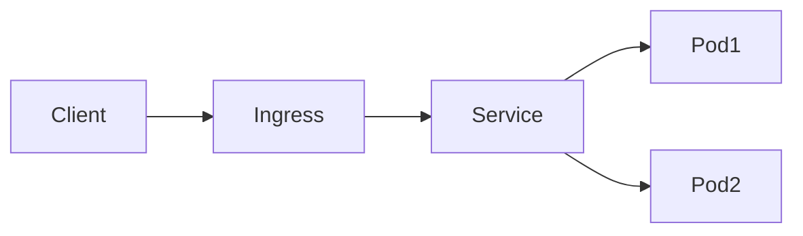

# Understanding Kubernetes Networking: A Complete Guide

## Introduction to Kubernetes Networking

Imagine Kubernetes as a large office building. Just like how people in an office need different ways to communicate - walking to someone's desk, using intercoms, or calling external clients - Kubernetes has different types of networking to handle various communication needs. Let's understand how all these pieces work together.

## Fundamental Networking Concepts

### 1. Container-to-Container Communication (Pod Networking)

Inside a Pod (think of it as a small office), containers share the same network namespace. This means:

- They share the same IP address
- They can communicate via localhost
- They share the same network resources

```yaml
apiVersion: v1
kind: Pod
metadata:
  name: multi-container-pod
spec:
  containers:
  - name: web
    image: nginx
  - name: logger
    image: fluentd
    # These containers can talk to each other using localhost
```

### 2. Pod-to-Pod Communication

Every Pod gets its own unique IP address. Think of this like each office room having its own extension number. Pods can communicate directly with each other using these IP addresses, regardless of which Node they're on.

The Container Network Interface (CNI) makes this possible. Some popular CNI plugins include:

- Calico
- Flannel
- Weave
- Cilium

Example network policy to control Pod communication:

```yaml
apiVersion: networking.k8s.io/v1
kind: NetworkPolicy
metadata:
  name: allow-frontend-to-backend
spec:
  podSelector:
    matchLabels:
      app: backend
  ingress:
  - from:
    - podSelector:
        matchLabels:
          app: frontend
```

### 3. Pod-to-Service Communication

Services provide a stable endpoint for Pods. Think of a Service as a receptionist who knows where all employees are located:

```yaml
apiVersion: v1
kind: Service
metadata:
  name: backend-service
spec:
  selector:
    app: backend
  ports:
  - protocol: TCP
    port: 80
    targetPort: 8080
```

### 4. External-to-Service Communication

There are multiple ways for external traffic to reach your services:

1. **NodePort**: Opens a port on every node
2. **LoadBalancer**: Creates an external load balancer
3. **Ingress**: Provides HTTP/HTTPS routing

Example Ingress configuration:

```yaml
apiVersion: networking.k8s.io/v1
kind: Ingress
metadata:
  name: my-ingress
spec:
  rules:
  - host: myapp.example.com
    http:
      paths:
      - path: /api
        pathType: Prefix
        backend:
          service:
            name: api-service
            port:
              number: 80
```

## How Kubernetes Networking Actually Works

### 1. The Container Network Interface (CNI)

CNI is like the networking rulebook for Kubernetes. It defines how network resources should be allocated and configured. Here's what happens when a Pod is created:

1. Kubelet creates the Pod's network namespace
2. Kubelet calls the configured CNI plugin
3. CNI plugin:
   - Allocates an IP address
   - Sets up the network interfaces
   - Configures routes and firewalls

### 2. Service Networking

Services use iptables or IPVS to route traffic. Here's the process:

1. kube-proxy watches for Service changes
2. When a Service is created:
   - Virtual IP (ClusterIP) is allocated
   - iptables rules are created to redirect traffic
   - Traffic to ClusterIP is load balanced to Pod IPs

### 3. DNS in Kubernetes

CoreDNS provides service discovery. It works like this:

1. Each Service gets a DNS record
2. Format: service-name.namespace.svc.cluster.local
3. Pods can be discovered using:
   - pod-ip-address.namespace.pod.cluster.local

## Network Flow Examples

### 1. External Client to Pod

When an external client accesses your application:

1. Traffic hits the Ingress or LoadBalancer
2. Request is forwarded to a Service
3. Service routes to a Pod
4. Response follows the reverse path



### 2. Pod to Pod Communication

When pods communicate across nodes:

1. Pod1 sends traffic to Pod2's IP
2. Node1's CNI forwards traffic to Node2
3. Node2's CNI delivers to Pod2

## Advanced Networking Concepts

### 1. Network Policies

Network Policies are like firewall rules for your Pods:

```yaml
apiVersion: networking.k8s.io/v1
kind: NetworkPolicy
metadata:
  name: db-policy
spec:
  podSelector:
    matchLabels:
      app: database
  policyTypes:
  - Ingress
  ingress:
  - from:
    - podSelector:
        matchLabels:
          role: backend
    ports:
    - protocol: TCP
      port: 5432
```

### 2. Service Mesh

Service meshes like Istio add features like:

- Mutual TLS
- Traffic monitoring
- Advanced routing
- Circuit breaking

### 3. Load Balancing Strategies

Different ways traffic can be distributed:

- Round Robin (default)
- Session Affinity
- Custom load balancing (using Service Mesh)

## Troubleshooting Network Issues

### 1. Common Problems and Solutions

1. **Pod Can't Reach Service**

   ```bash
   # Check DNS resolution
   kubectl exec -it <pod-name> -- nslookup kubernetes.default
   
   # Check service endpoints
   kubectl get endpoints <service-name>
   ```

2. **Service Not Accessible**

   ```bash
   # Check service configuration
   kubectl describe service <service-name>
   
   # Check pod labels match service selector
   kubectl get pods --show-labels
   ```

3. **Network Policy Issues**

   ```bash
   # Check applied network policies
   kubectl get networkpolicies
   
   # Describe specific policy
   kubectl describe networkpolicy <policy-name>
   ```

### 2. Debugging Tools

Essential tools for network debugging:

```bash
# Network debugging container
kubectl run network-debug --rm -i --tty --image=nicolaka/netshoot -- /bin/bash

# Port forwarding for testing
kubectl port-forward service/my-service 8080:80

# Check pod networking
kubectl exec -it <pod-name> -- ip addr
```

## Best Practices

1. **Security**
   - Always use Network Policies
   - Implement least privilege access
   - Use mTLS where possible

2. **Performance**
   - Monitor network latency
   - Use appropriate Service types
   - Configure proper health checks

3. **Scalability**
   - Choose the right CNI plugin
   - Plan IP address ranges carefully
   - Consider multi-cluster networking

Remember: Kubernetes networking is designed to be simple from a user's perspective but complex under the hood. Understanding these concepts helps you better design, deploy, and troubleshoot your applications.
